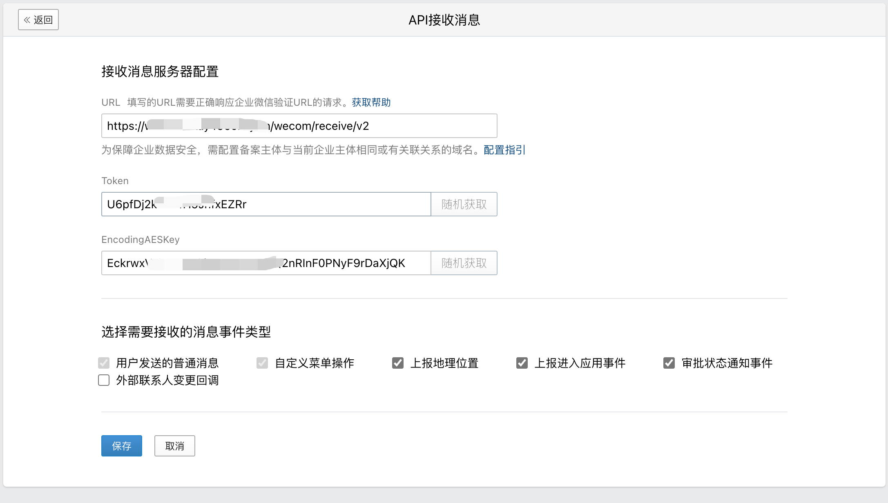

# 简介

在企业微信通过内部应用接入ChatGPT，支持：
* 多轮会话功能
* 图片OCR功能
* openai代理
* 单聊

功能截图：
企业微信内部应用：

多轮会话功能：

OCR功能：

# 安装方法

0. 准备工作：在企业微信添加一个内部应用
1. 克隆代码：`git clone https://gitee.com/okay456okay/wecom-chatgpt.git`
2. 安装依赖包: `pip install -r requirements.txt`
3. 添加配置信息：复制 `config-template.py` 为 `config.py`，修改里面的配置：
   1. 百度OCR的Api key和Api secret
   2. ChatGPT的api key，提供了3种示例（api2d（国内可访问，收费，支持国内付费方式）、pawan（可国内访问，免费但不稳定）、openapi官方（国内需科学上网，需要设置代理）），选择其中一种即可。
   3. 企业微信接收消息配置, 设置完成后启动程序（第4步）做URL验证。替换URL域名为你自己的服务器地址，注意是http还是https，如图所示：  
   4. 企业微信应用添加可信IP, 如下图所示； 
4. 启动程序：`python main.py`
